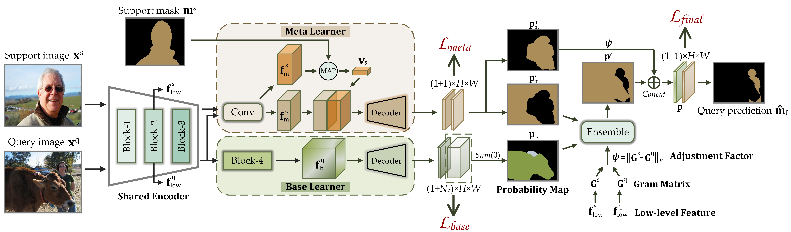
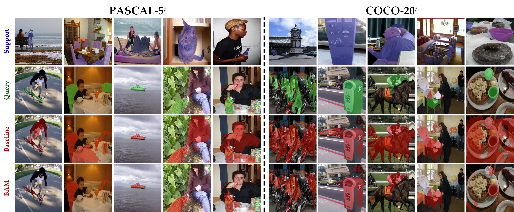

<!--
[](https://paperswithcode.com/sota/few-shot-semantic-segmentation-on-pascal-5i-1?p=learning-what-not-to-segment-a-new)
[](https://paperswithcode.com/sota/few-shot-semantic-segmentation-on-pascal-5i-5?p=learning-what-not-to-segment-a-new)
[](https://paperswithcode.com/sota/few-shot-semantic-segmentation-on-coco-20i-1?p=learning-what-not-to-segment-a-new)
[](https://paperswithcode.com/sota/few-shot-semantic-segmentation-on-coco-20i-5?p=learning-what-not-to-segment-a-new)
-->
# Learning What Not to Segment: A New Perspective on Few-Shot Segmentation

This repo contains the code for our **CVPR 2022 Oral** [paper](http://arxiv.org/abs/2203.07615) "*Learning What Not to Segment: A New Perspective on Few-Shot Segmentation*" by Chunbo Lang, Gong Cheng, Binfei Tu, and Junwei Han. 

> **Abstract:** *Recently few-shot segmentation (FSS) has been extensively developed. Most previous works strive to achieve generalization through the meta-learning framework derived from classification tasks; however, the trained models are biased towards the seen classes instead of being ideally class-agnostic, thus hindering the recognition of new concepts. This paper proposes a fresh and straightforward insight to alleviate the problem. Specifically, we apply an additional branch (base learner) to the conventional FSS model (meta learner) to explicitly identify the targets of base classes, i.e., the regions that do not need to be segmented. Then, the coarse results output by these two learners in parallel are adaptively integrated to yield precise segmentation prediction. Considering the sensitivity of meta learner, we further introduce an adjustment factor to estimate the scene differences between the input image pairs for facilitating the model ensemble forecasting. The substantial performance gains on PASCAL-5<sup>i</sup> and COCO-20<sup>i</sup> verify the effectiveness, and surprisingly, our versatile scheme sets a new state-of-the-art even with two plain learners. Moreover, in light of the unique nature of the proposed approach, we also extend it to a more realistic but challenging setting, i.e., generalized FSS, where the pixels of both base and novel classes are required to be determined.*

<p align="middle">
  
</p>

## :sparkles: News

**[April 5, 2023]**
- The extended version of this work is accepted to **TPAMI 2023**.

**[Mar 2, 2022]**
- BAM is accepted to **CVPR 2022**.

**[Mar 29, 2022]**
- Our paper is selected for an <font color='red'> **oral** </font> presentation.

**[May 23, 2022]**
- We release all the trained **models** to facilitate validation.

**[Jun 16, 2022]**
- The generated **base annotations** are available.

## &#x1F527; Usage
### Dependencies

- Python 3.8
- PyTorch 1.7.0
- cuda 11.0
- torchvision 0.8.1
- tensorboardX 2.14

### Datasets

- PASCAL-5<sup>i</sup>:  [VOC2012](http://host.robots.ox.ac.uk/pascal/VOC/voc2012/) + [SBD](http://home.bharathh.info/pubs/codes/SBD/download.html)

- COCO-20<sup>i</sup>:  [COCO2014](https://cocodataset.org/#download)

   Download the [data](https://mailnwpueducn-my.sharepoint.com/:u:/g/personal/langchunbo_mail_nwpu_edu_cn/ESvJvL7X86pNqK5LSaKwK0sByDLwNx0kh73PVJJ_m1vSCg?e=RBjfKp) lists (.txt files) and put them into the `BAM/lists` directory. 

- Run `util/get_mulway_base_data.py` to generate [base annotations](https://mailnwpueducn-my.sharepoint.com/:f:/g/personal/langchunbo_mail_nwpu_edu_cn/Eg7-69tgeE5Em5jEHUyvafEBA9Gj9ZCtCNV-N8rtcxySKg?e=dFvKW5) for **stage1**, or directly use the trained weights.

### Models

- Download the pre-trained backbones from [here](https://mailnwpueducn-my.sharepoint.com/:u:/g/personal/langchunbo_mail_nwpu_edu_cn/EflpnBbWaftEum485cNq8v8BdSHiKvXLaX-dBBsbtdnCjg?e=WLcfhd) and put them into the `BAM/initmodel` directory. 
- Download our trained base learners from [OneDrive](https://mailnwpueducn-my.sharepoint.com/:u:/g/personal/langchunbo_mail_nwpu_edu_cn/ETERT3xe5ndEpDhStts7JmcBlYDY_2G0hPVJUBtLLG-njg?e=MLzVIL) and put them under `initmodel/PSPNet`. 
- We provide all trained BAM [models](https://mailnwpueducn-my.sharepoint.com/:f:/g/personal/langchunbo_mail_nwpu_edu_cn/ElxMt3Mr9xBMr41BrOOE5JABEVnJ5f9-SVBRutEhpY3vxg?e=upF3mf) for performance evaluation. _Backbone: VGG16 & ResNet50; Dataset: PASCAL-5<sup>i</sup> & COCO-20<sup>i</sup>; Setting: 1-shot & 5-shot_.

### Scripts

- Change configuration via the `.yaml` files in `BAM/config`, then run the `.sh` scripts for training and testing.

- **Stage1** *Pre-training*

  Train the base learner within the standard learning paradigm.

  ```
  sh train_base.sh
  ```

- **Stage2** *Meta-training*

  Train the meta learner and ensemble module within the meta-learning paradigm. 

  ```
  sh train.sh
  ```

- **Stage3** *Meta-testing*

  Test the proposed model under the standard few-shot setting. 

  ```
  sh test.sh
  ```

- **Stage4** *Generalized testing*

  Test the proposed model under the generalized few-shot setting. 

  ```
  sh test_GFSS.sh
  ```

### Performance

Performance comparison with the state-of-the-art approaches (*i.e.*, [HSNet](https://github.com/juhongm999/hsnet) and [PFENet](https://github.com/dvlab-research/PFENet)) in terms of **average** **mIoU** across all folds. 

1. ##### PASCAL-5<sup>i</sup>

   | Backbone | Method     | 1-shot                   | 5-shot                   |
   | -------- | ---------- | ------------------------ | ------------------------ |
   | VGG16    | HSNet      | 59.70                    | 64.10                    |
   |          | BAM (ours) | 64.41 <sub>(+4.71)</sub> | 68.76 <sub>(+4.66)</sub> |
   | ResNet50 | HSNet      | 64.00                    | 69.50                    |
   |          | BAM (ours) | 67.81 <sub>(+3.81)</sub> | 70.91 <sub>(+1.41)</sub> |

2. ##### COCO-20<sup>i</sup>

   | Backbone | Method     | 1-shot                   | 5-shot                   |
   | -------- | ---------- | ------------------------ | ------------------------ |
   | VGG16    | PFENet     | 36.30                    | 40.40                    |
   |          | BAM (ours) | 43.50 <sub>(+7.20)</sub> | 49.34 <sub>(+8.94)</sub> |
   | ResNet50 | HSNet      | 39.20                    | 46.90                    |
   |          | BAM (ours) | 46.23 <sub>(+7.03)</sub> | 51.16 <sub>(+4.26)</sub> |

### Visualization

<p align="middle">
    
</p>

### To-Do List

- [x] Support different backbones
- [x] Support various annotations for training/testing
- [x] Multi-GPU training
- [ ] FSS-1000 dataset

## References

This repo is mainly built based on [PFENet](https://github.com/dvlab-research/PFENet), [RePRI](https://github.com/mboudiaf/RePRI-for-Few-Shot-Segmentation), and [SemSeg](https://github.com/hszhao/semseg). Thanks for their great work!

## BibTeX

If you find our work and this repository useful. Please consider giving a star :star: and citation &#x1F4DA;.

```bibtex
@InProceedings{lang2022bam,
  title={Learning What Not to Segment: A New Perspective on Few-Shot Segmentation},
  author={Lang, Chunbo and Cheng, Gong and Tu, Binfei and Han, Junwei},
  booktitle={Proceedings of the IEEE/CVF Conference on Computer Vision and Pattern Recognition (CVPR)},
  pages={8057--8067},
  year={2022},
  }  
  
@article{lang2023bam,
	title={Base and Meta: A New Perspective on Few-shot Segmentation},
	author={Lang, Chunbo and Cheng, Gong and Tu, Binfei and Li, Chao and Han, Junwei},
	journal={IEEE Transactions on Pattern Analysis and Machine Intelligence (PAMI)},
	pages={1--18},
	year={2023},
	doi={10.1109/TPAMI.2023.3265865},
}
```

